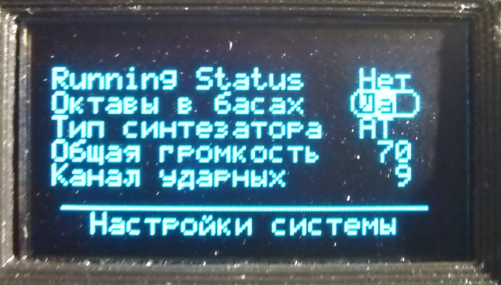

# Инструкция пользователя

Данный документ применим для версии прошивки 1.00.

## Базовые концепции

Данная реализация MIDI-баяна является, по сути, MIDI-клавиатурой, сделанной на основе баяна "Рубин-5". Для игры на данном инструменте требуется как минимум синтезатор со стандартным MIDI-входом. Это может быть как программный синтезатор, запущенный на компьютере (в этом случае понадобится переходник MIDI->USB), так и любой синтезатор или синтезаторный модуль с MIDI входом (DIN-5). Встроенного источника звука в данной реализации MIDI-баяна нет.

Баян "Рубин-5" - готово-выборный. Для него заданы 4 логических клавиатуры:

* правая
* басы (для режима "готовый аккомпанемент")
* аккорды (для режима "готовый аккомпанемент")
* выборная (для режима "выборная клавиатура")

Каждая логическая клавиатура связана со своим отдельным MIDI каналом. По-умолчанию это каналы с 1-го по 4-й. Как следствие, звучание каждой логической клавиатуры настраивается совершенно независимо от остальных.

Ритм-машина, вне зависимости от режима её работы, всегда связана со своим MIDI каналом. По-умолчанию это канал №10.

В MIDI-баяне встроен дифференциальный датчик давления, который измеряет разницу давлений внутри и снаружи герметичного корпуса баяна. Это позволяет управлять громкостью звука с помощью меха, точно так же, как это делается при игре на обычном баяне. Датчик давления можно отключить специальной кнопкой на панели управления; в этом случае всегда будет использоваться значение громкости, заданное в системных настройках (независимо от силы растяжения или сжатия меха инструмента).

Переключение режимов работы левой клавиатуры производится штатным переключателем, с которым связан специальный датчик положения переключателя режима левой клавиатуры. Текущий режим отображается на экране панели управления.

Реализация MIDI для разных синтезаторов различается. Отличия могут быть как в списке поддерживаемых MIDI команд, так и в том, что на одни и те же команды разные синтезаторы будут реагировать по-разному (например, на управляющие команды переключения между разными банками инструментов). Я в качестве синтезатора выбрал [cинтезаторный модуль ATEMP MIDI HW Synth](https://atemp.ru/products/atemp_midi_hw_synth.html). Поэтому в данном MIDI-баяне есть два режима работы с синтезатором:

* "ATEMP" - в этом режиме в настройках звука можно выбрать только те значения параметров, которые поддерживаются синтезатором; неподдерживаемые параметры пропускаются; это существенно ускоряет перебор доступных вариантов и упрощает настройки.
* "General MIDI" - в этом режиме в настройках можно выбрать любые значения параметров, поддерживаемых в текущей версии прошивки.

Если требуется учесть особенности каких-то других синтезаторов, то для этого нужно добавлять их поддержку в прошивку.

Для работы MIDI-системы необходимо для каждого клапана (не для кнопок, а для клапанов) в правой и в левой клавиатурах установить датчик Холла, а на рычаги самих клапанов - неодимовые магниты. Конструкции разных баянов могут очень сильно различаться, поэтому адаптация принципиальной схемы MIDI-баяна и выбор конструктивного решения установки датчиков находятся за рамками данного документа. Текущая реализация (принципиальная схема, печатные пллаты и способ их установки в баян) адаптирована исключительно для баяна "Рубин-5".

Функциональные возможности прошивки, однако, не зависят от конкретной аппаратной реализации и в полном объёме описаны в данном документе.

## Внешний вид и органы управления

* Экран OLED - отображает текущие настройки и режим работы MIDI системы
* Кнопки перемещения по меню - перемещают указатель текущего параметра
* Кнопка "ок" - начинает и заканчивает изменение выбранного параметра
* Кнопка вызова меню редактирования параметров - вызывает меню редактирования настроек звука для всех клавиатур; а также вызывает меню редактирования системных параметров
* Программируемые кнопки F1-F4 - позволяют одним нажатием сразу перейти в режим редактирования выбранного ранее параметра звука или системного параметра
* Кнопки пресетов - загружают выбранный пресет из энергонезависимой памяти, а также позволяют записывать текущие настройки в любой выбранный пресет
* Кнопка синхронизации синтезатора - загружает текущие настройки в подключённый синтезатор
* Кнопка включения датчика давления - включает или выключает датчик давления
* Кнопка управления ритм-машиной - включает/выключает ритм-машину, позволяет выбрать режим работы ритм-машины и вызывает меню настройки ритм-машины
* Кнопка выбора варианта ритма - циклически перебирает все имеющиеся в прошивке варианты ритма
* Кнопки управления темпом - уменьшают или увеличивают темп воспроизведения выбранного варианта ритма
* Индикаторы пресетов - показывают выбранный в данный момент пресет
* Индикатор режима ритм-машины - показывает текущий режим работы ритм-машины
* Индикатор активности MIDI порта - мигает при отправке каждой MIDI-команды в синтезатор
* Системный индикатор - используется во время программирования программируемых кнопок F1-F4

## Начало работы

Перед включением MIDI-баяна следует подключить его к синтезатору с помощью MIDI кабеля.

Сразу после включения баян находится в полностью работающем состоянии, но настройки синтезатора отличаются от настроек текущего пресета. Для синхронизации настроек баяна и синтезатора необходимо нажать и отпустить кнопку кинхронизации синтезатора на панели управления. Баян отправит в синтезатор серию MIDI-команд, настраивающих синтезатор в соответствии с текущим пресетом. Это нужно делать только один раз, после включения (а также если по каким-то причинам синтезатор был выключен, а потом снова включен). В дальнейшем баян сам будет заботиться о настройках синтезатора.

После синхронизации с синтезатором баян полностью готов к игре.

## Основной экран

После включения экран находится в режиме отображения общей информации о текущем состоянии баяна.

1. строка состояния логических клавиатур
1. область показа ключевых настроек для каждой клавиатуры
1. индикаторы текущих системных параметров
1. служебная строка

### <a id="kbd-state" /> Строка состояния логических клавиатур

В этой строке состояния показан статус каждой логической клавиатуры:

* `Пр.` - правая
* `Бас` - басы
* `Акк` - аккорды
* `Выб` - выборная

В каждый момент времени активные клавиатуры выделены светлым фоном. Переключение между клавиатурами производится штатным переключателем режима левой клавиатуры.

### Область показа ключевых настроек для каждой клавиатуры

В данной области отображаются текущие значения трёх основных настроек для каждой клавиатуры:

* `Канал` - номер MIDI-канала, связанного с клавиатурой (возможные значения - от 0 до 15)
* `Банк` - выбранный банк инструментов (возможные значения - от 0 до 127)
* `Инстр.` - выбранная программа (инструмент) (возможные значения - от 0 до 127)

Изменение этих настроек возможно в режиме редактирования настроек звука (см. ниже).

### Индикаторы текущих системных параметров

В текущей версии отображаются индикаторы следующих системных параметров:

* `Окт` - разрешение/запрет октав в басах; если октавы разрешены, то индикатор выделен светлым фоном.
* `Мех` - управление громкостью с помощью меха (включено или выключено); если включено, то индикатор выделен светлым фоном
* Режим совместимости с синтезатором. В данный момент доступно 2 значения:
    * `GM` - General MIDI
    * `AT` - поддержка синтезатора [ATEMP MIDI HW Synth](https://atemp.ru/products/atemp_midi_hw_synth.html)
* Состояние режима "[Running Status](http://midi.teragonaudio.com/tech/midispec/run.htm)"

Включение/выключение управления громкостью с помощью меха производится соответствующей кнопкой на панели управления. Остальные параметры настраиваются в режиме редактирования системных параметров (см. ниже).

### Служебная строка

В служебной строке на основном экране отображается либо текущая версия прошивки MIDI-баяна, либо название выбранной мелодии ритм-машины и заданный для этой мелодии темп. (Подробнее о ритм-машине - [ниже](#drumdoc).)

## Режим редактирования параметров звука

Режим редактирования параметров звука включается однократным непродолжительным нажатием кнопки "Меню" на панели управления. Выключается этот режим либо повторным нажатием кнопки "Меню", либо автоматически, если в течение 10 секунд не производились нажатия кнопок на панели управления.

1. строка состояния логических клавиатур
1. область редактирования параметров
1. служебная строка

### Строка состояния логических клавиатур

Здесь отображается та же самая информация, что и на основном экране ([см. выше](#kbd-state))

### Область редактирования параметров

В этой области экрана находится список параметров звука для каждой логической клавиатуры. В каждой строчке сначала расположено короткое название параметра, а затем 4 его значения - каждое под значком соответствующей клавиатуры. Стрелки вправо/влево перемещают указатель между колонками, а стрелки вверх/вниз перемещают указатель по строкам. При необходимости список прокручивается вертикально, т.к. параметров больше, чем помещается на один экран.

Для того, чтобы изменить выбранный параметр, нужно нажать кнопку "Ок". При этом указатель изменит свой вид, и значение параметра будет показано на светлом фоне. Менять значение можно стрелками влево/вправо, которые будут уменьшать или увеличивать значение. Стрелки вверх/вниз во время изменения параметра не работают. Для того, чтобы закончить изменение значения параметра, нужно снова нажать кнопку "Ок".

### Служебная строка

В режиме редактирования параметров звука в служебной строке показывается краткое описание выбранного параметра.

## <a id="sysparams" />Режим редактирования системных параметров

Режим редактирования системных параметров вызывается длительным (более 1 секунды) нажатием кнопки "Меню". Выключается этот режим либо простым нажатием кнопки "Меню", либо автоматически.

Изменять значение параметра можно сразу; нажимать кнопку "Ок" для этого не надо. Изменение производится с помощью стрелок влево/вправо.

### Running Status

Данный параметр управляет режимом "[Running Status](http://midi.teragonaudio.com/tech/midispec/run.htm)". Возможные значения  параметра: "Да", "Нет".

### Октавы в басах

Баян "Рубин-5" имеет следующую конструктивную особенность: при нажатии любой басовой клавиши в левой клавиатуре открываются не один, а два клапана, и вместе с нотой из контроктавы звучит та же нота из большой октавы. (То же самое происходит при нажатии 12 самых низких нот на выборной клавиатуре.) Для баяна это хорошо, т.к. делает бас более громким и насыщенным. А для MIDI-баяна - плохо, потому что некоторые инструменты плохо звучат с октавами.

Поэтому в данном MIDI-баяне предусмотрен режим запрета октав в басах. То есть если уже звучит самая низкая басовая нота, то срабатывания датчика более высокой ноты игнорируются.

Данный режим можно включать и выключать. Октавы могут быть очень уместны если, например, для басовой клавиатуры выбран звук фортепиано; в этом случае октавы звучат весьма неплохо.

### Тип синтезатора

Этот параметр задаёт тип подключенного в данный момент синтезатора. Доступно 2 варианта:

* `GM` - General MIDI
* `AT` - ATemp

### Общая громкость

Данный параметр задаёт общую базовую громкость для всех MIDI-каналов. Чтобы можно было одной настройкой управлять громкостью звучания всего инструмента в тех случаях, когда управление громкостью с помощью меха выключено.

Как известно, значения громкости в MIDI могут меняться от 0 до 127. И значение громкости по-умолчанию для каждого канала - 127 (максимальная громкость). При этом реальные значения громкости, отправляемые в синтезатор, масштабируются в пределах от 0 до текущего значения общей громкости.

### Канал ударных

Здесь задаётся номер MIDI-канала для ударных инструментов. Обычно, это канал №10 (в данной прошивке MIDI каналы и инструменты нумеруются с 0, а не с 1, т.е. используются те же значения, что и в MIDI-командах, поэтому номер канала ударных задан как "9", что соответствует 10-му каналу в традиционной записи).

Изменять номер канала ударных вряд-ли когда-нибудь понадобится, но такая возможность есть.

## <a id="drumparams" />Режим редактирования настроек ударных инструментов

Режим редактирования настроек ударных инструментов вызывается длительным (более 1 секунды) нажатием кнопки управления ритм-машиной. Выключается этот режим либо простым нажатием кнопки "Меню", либо автоматически.

Изменять значение параметра можно сразу; нажимать кнопку "Ок" для этого не надо. Изменение производится с помощью стрелок влево/вправо.

### Громкость ударных

Здесь задаётся громкость канала ударных инструментов. Точно так же, как и громкость клавиатур, реальная громкость ударных ограничивается системной настройкой "Общая громкость".

**Обратите внимание**: громкость в канале ударных инструментов *не управляется мехом*, даже если этот режим включен. Громкость ударных всегда фиксирована. Это делает возможной выразительную игру при сопровождении ударного авто-аккомпанемента. А также позволяет, не двигая мехом, извлекать только звук ударного инструмента, связанного либо с басовыми клавишами, либо с клавишами аккордов (см. также описание работы ритм-машины ниже).

### Набор звуков

Это то, что в англоязычной документации называется "drumset". Технически - это "инструмент" (или "программа"), выбираемая для канала ударных. Количество поддерживаемых наборов звуков зависит от конкретного синтезатора.

### Звук для баса

Здесь задаётся звук ударного инструмента, связанный с клавишами басов.

### ... его сила

Здесь задаётся сила удара по выбранному инструменту. (По барабану можно ударить легко, а можно ударить очень сильно. Звук при этом будет разный.) Допустимые значения - от 1 до 127. Если указан 0, то звук издаваться не будет.

### Звук для аккорда

Здесь задаётся звук ударного инструмента, связанный с клавишами аккордов.

### ... его сила

То же, что сила звука для баса.

## Пресеты и работа с ними

Настройки звука для всех логических клавиатур, а также настройки ударных инструментов объединены в так называемые пресеты. Пресеты можно сохранять в энергонезависимой памяти. Всего в MIDI-баяне можно сохранить 6 пресетов.

### Переключение между пресетами

Для активации нужного пресета надо кратковременно нажать и отпустить кнопку соответствующего пресета. В момент отпускания кнопки происходит чтение пресета из энергонезависимой памяти и отправка в синтезатор MIDI-команд, настраивающих его в соответствии с пресетом. После активации пресета загорается соответствующий индикатор.

### Редактирование пресета

При изменении значений параметров, являющихся частью пресета, баян начинает сигнализировать, что текущие настройки отличаются от тех, которые были прочитаны для текущего пресета из энергонезависимой памяти. То есть, в оперативной памяти находятся несохранённые изменения. Сигналом наличия несохраненных изменений является медленно мигающий индикатор текущего пресета.

Если у пользователя нет намерения сохранять изменённые настройки для использования в будущем, то сигнал о наличии несохранённых изменений можно полностью игнорировать.

### Сохранение пресета в энергонезависимой памяти

Текущие настройки можно сохранить в любой из 6-ти имеющихся ячеек.

Для сохранения пресета нужно нажать и удерживать кнопку выбранного для сохранения пресета. Индикатор, соответствующий нажатой кнопке, начнёт быстро мигать. Он будет мигать в течение 3-х секунд. Если в это время отпустить кнопку пресета, то запись будет отменена. (Это сделано для того, чтобы не испортить сохранённый ранее пресет, случайным длительным нажатием кнопки пресета.) Если по истечению 3-х секунд кнопка пресета не была отпущена, то текущие настройки сохраняются в пресет и индикатор только что сохранённого пресета прекращает мигать. В этот момент кнопку пресета можно отпускать.

Сохраненный пресет становится активным, о чём сообщает постоянно светящийся соответствующий индикатор.

## Программируемые кнопки F1 - F4

Данные программируемые кнопки предназначены для быстрого изменения заранее назначенных параметров, как системных, так и параметров звука для логических клавиатур.

По-умолчанию, все кнопки назначены на изменение номера MIDI-канала для правой клавиатуры (самый первый параметр в списке всех параметров звука логических клавиатур).

### Программирование кнопок быстрого доступа

Процесс программирования состоит из двух шагов:

1. Выбор параметра, быстрый доступ к изменению которого нужно запрограммировать.
2. Назначение выбранной кнопки быстрого доступа

#### Выбор параметра

Для выбора параметра нужно просто начать его изменять. Если это параметр звука, то нужно войти в режим редактирования параметров звука, переместить указатель к нужному параметру и нажать конпку "ok", чтобы войти в режим изменения. Если это системный параметр, то нужно войти в режим изменения системных параметров и переместить указатель к нужному параметру.

#### Назначение кнопки быстрого доступа

Нажать и удерживать выбранную кнопку F1 - F4. Системный индикатор начнёт быстро мигать. Он будет мигать в течение 3-х секунд. Если в это время отпустить кнопку, то запись будет отменена. (Это сделано для того, чтобы избежать случайного перепрограммирования кнопок быстрого доступа.) Если по истечению 3-х секунд кнопка быстрого доступа не была отпущена, то она связывается с выбранным ранее параметром и системный индикатор прекращает мигать. В этот момент кнопку быстрого доступа можно отпускать.

### Использование кнопок быстрого доступа

Использовать кнопки F1 - F4 можно только в 3-х режимах:

* Основной экран
* Режим редактирования параметров звука
* Режим редактирования системных параметров

Находясь в одном из перечисленных выше режимов, нужно просто однократно нажать и отпустить одну из кнопок F1 - F4, ранее связанную с параметром, который нужно изменить.

## Системные параметры и энергонезависимая память

В число системных параметров, автоматически сохраняемых в энергонезависимой памяти, входят:

* Явно редактируемые параметры описанные [в соответствующем разделе выше](#sysparams).
* Номер активного в данный момент пресета
* Номер MIDI-канала для ударных инструментов (является частью [настроек ударных инструментов](#drumparams))
* Настройки клавиш быстрого доступа F1 - F4.

Каждый раз, когда что-либо из перечисленного выше изменяется, в системе запускается таймер автоматической записи. Если в течение 8 секунд после последнего изменения больше никакие системные настройки не изменялись, то все накопленные к данному моменту изменения записываются в энергонезависимую память.

Сохранённые системные настройки восстанавливаются из энергонезависимой памяти при каждом включении баяна.

## <a id="drumdoc" />Ритм-машина

Ритм-машина, реализованная в данной версии MIDI-баяна, может работать в одном из двух режимов:

* Ручной аккомпанемент
* Автоматический аккомпанемент

В режиме ручного аккомпанемента на каждое нажатие басовой клавиши воспроизводится звук первого выбранного ударного инструмента, а на каждое нажатие клавиши аккорда воспроизводится звук второго ударного инструмента. (Настройки этих звуков описаны [выше](#drumparams).) Этот режим будет работать только если левая клавиатура находится в режиме готового аккомпанемента. Если левая клавиатура в выборном режиме - ритм-машина не будет реагировать на нажатия клавиш левой клавиатуры.

В режиме автоматического аккомпанемента воспроизводится одна из имеющихся в прошивке мелодий (т.е. один из вариантов ритма).В данной версии MIDI-баяна как-то изменять звучание ритмов нельзя. Управлять можно только громкостью и темпом воспроизведения.

Управление режимом работы ритм-машины осуществляется кнопкой управления ритм-машиной. Эта кнопка циклически перебирает следующие состояния ритм-машины:

| Состояние ритм-машины | Описание | Индикатор режима ритм-машины |
|---|---|---|
| Выключено | В данном состоянии ритм-машина находится после включения MIDI-баяна | Не горит |
| Ручной аккомпанемент | Ритм-машина воспроизводит звуки, связанные с клавишами басов и аккордов | Светится постоянно |
| Ожидание старта автоматического аккомпанемента | Воспроизведение выбранного в данный момент варианта ритма начнётся одновременно с первым нажатием любой клавиши баса в левой клавиатуре. Это позволяет играть вступления до того, как начнет проигрываться партия ударных. В данном состоянии уже можно выбирать вариант ритма кнопкой выбора варианта ритма, а также устанавливать темп кнопками управления темпом. | Быстро мигает |
| Автоматический аккомпанемент | Воспроизводится выбранный вариант ритма. Можно выбирать вариант ритма и менять темп воспроизведения. | Медленно мигает |

## Сигнализация о внутренних ошибках в прошивке

Как и в любой программе, в прошивке MIDI-баяна были и наверняка всё ещё есть необнаруженные до сих пор ошибки. В ключевых местах кода имеются специальные проверки, которые обнаруживают случаи, когда "что-то пошло совсем не так, как должно было". В случае обнаружения подобной ошибки происходит следующее:

* Одновременно загораются и продолжают гореть индикатор режима ритм-машины, индикатор активности MIDI порта и cистемный индикатор.
* На индикаторах пресетов при этом отображается двоичный код обнаруженной внутренней ошибки.
* MIDI-баян прекращает реагировать на нажатия любых кнопок и клавиш. Вывести его из этого состояния можно только выключив его и снова включив.

Коды ошибок ункальные. По коду можно точно определить, в каком месте программы произошла недопустимая ошибка. Все возможные коды ошибок определены в файле `swer.h`.

